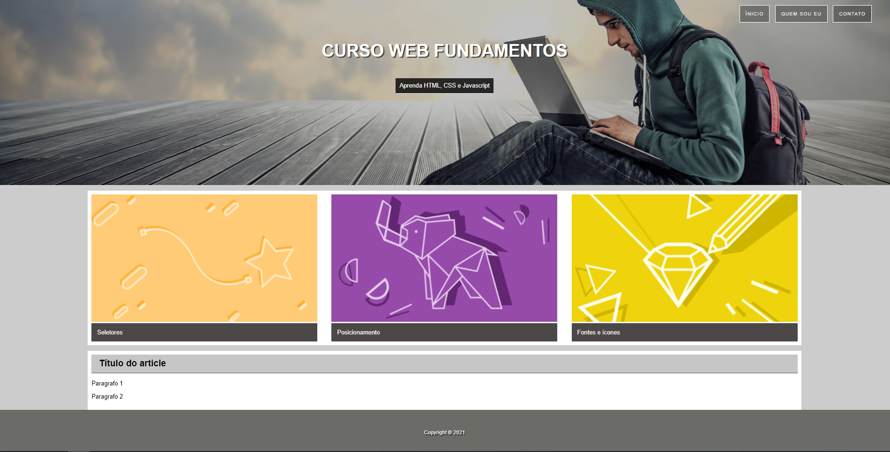
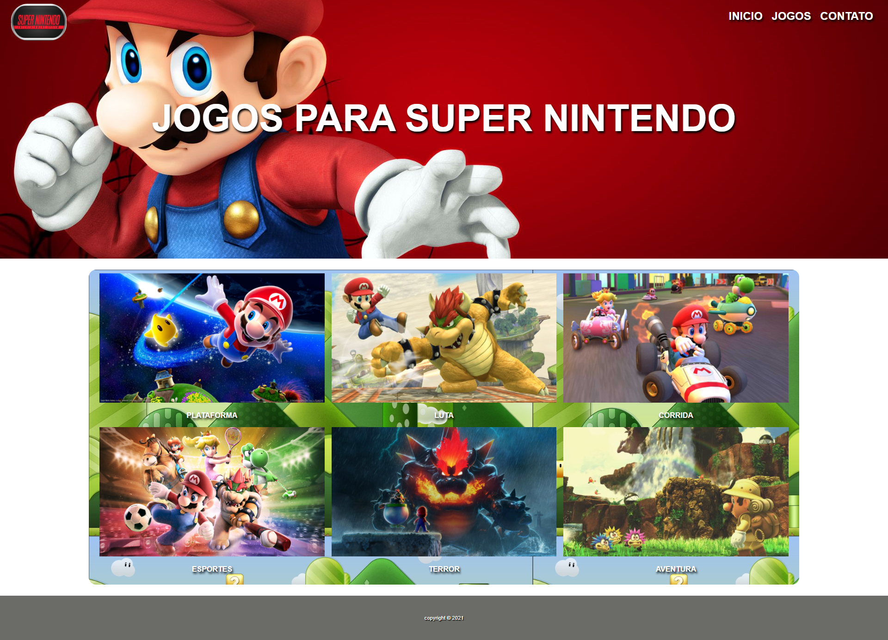
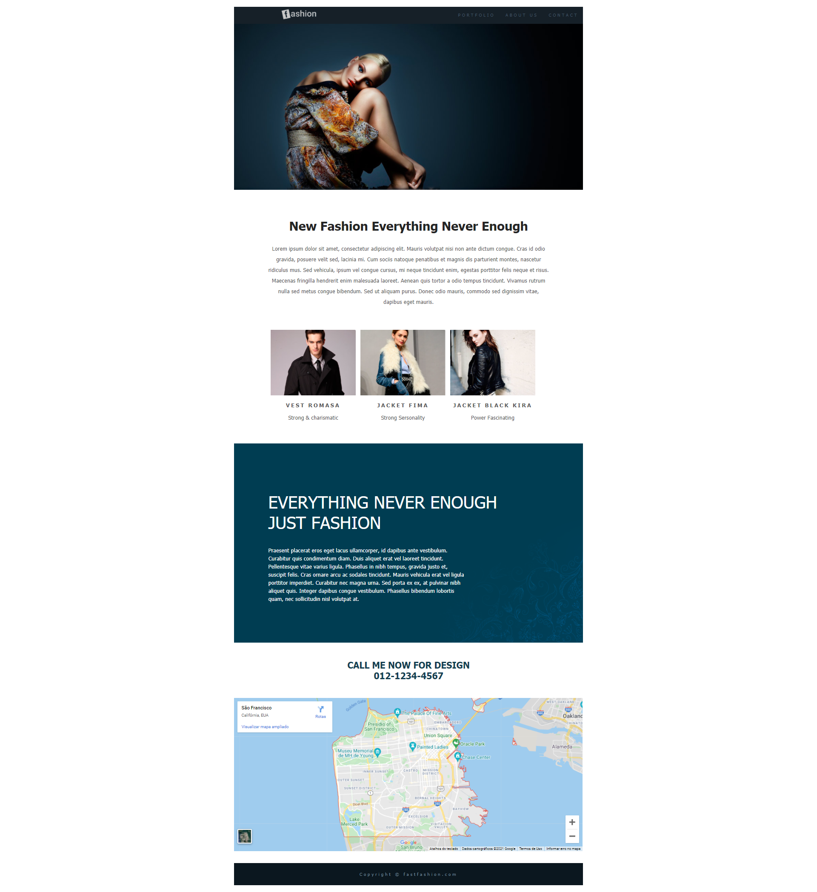
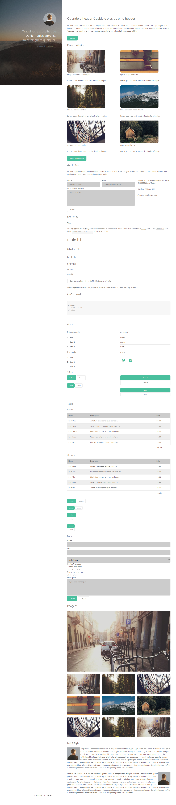
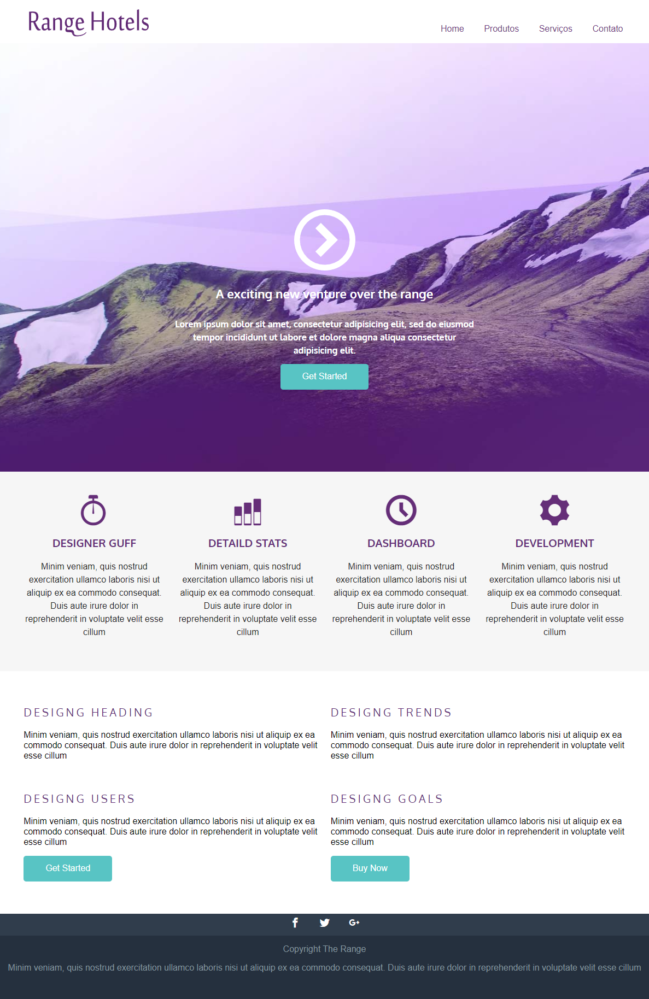
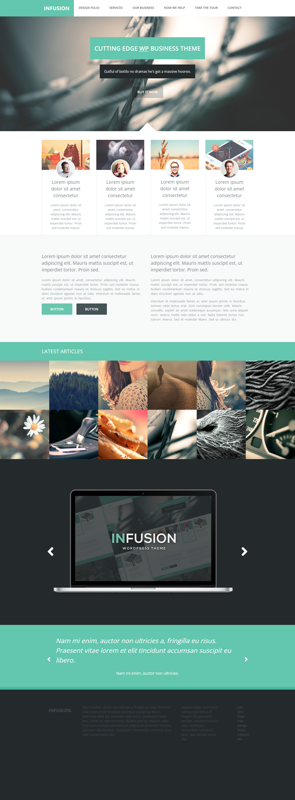

<h1 align="center">Curso de Desenvolver Web com HTML5, CSS3 e Javascript na UDEMY.</h1>

## TECNOLOGIAS USADAS:

- [Visual Studio Code](https://code.visualstudio.com/)
- [Google Chrome](https://www.google.pt/intl/pt-PT/chrome/?brand=ISCS&gclid=Cj0KCQiA0eOPBhCGARIsAFIwTs7MtoVzQ-rm4vbjemkoPcJ1CxfR9I0zNTAft1ONruA8Dz2sie1ZG7QaAmHOEALw_wcB&gclsrc=aw.ds)

<h2>PROJETOS:</h2>

<h3 align="center">Curso WEB</h3>

<h3 align="center">Super Nintendo</h3>

<h3 align="center">Fashion</h3>

<h3 align="center">Strata</h3>

<h3 align="center">Hotel Range</h3>

<h3 align="center">Infusion</h3>

